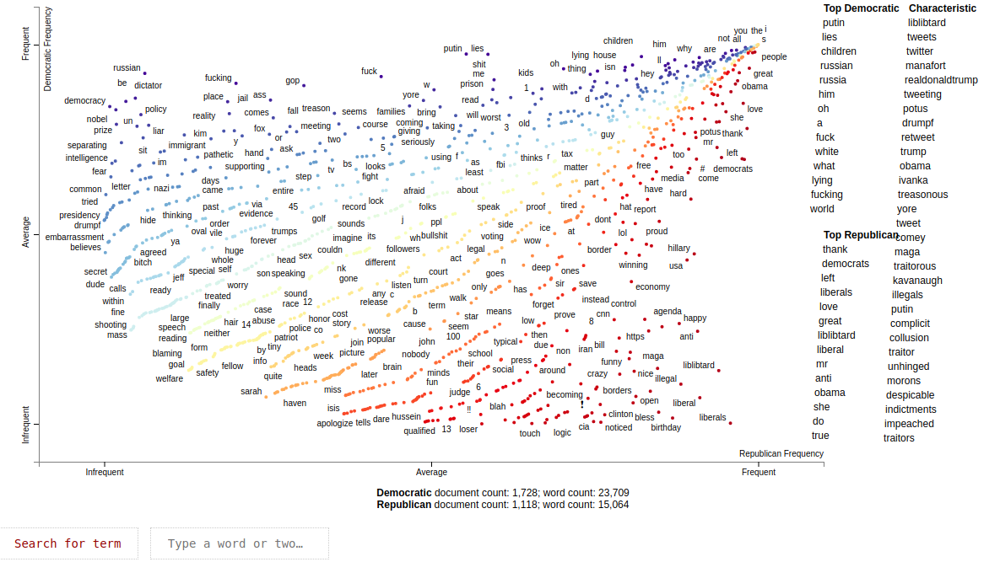
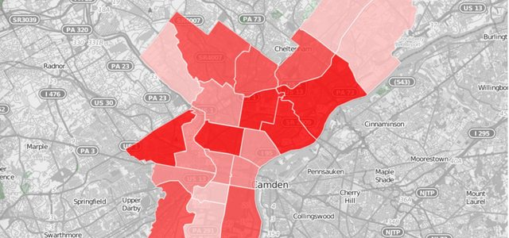
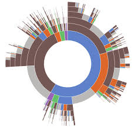

Final Report of GSoC 2019 CLiPS Project "viNLaP".

You can find the official repository, [here](https://github.com/clips/gsoc2019_vinlap) . 

---

# viNLaP

Welcome to viNLaP: Visualizing Natural Language Processing on polarized data sources!

This project was conceived due to the need of visualize polarized data easily and effectively. The first version of vinLAp aims to show an overview of the MAGA corpus, crawled in GSoC 2018 by Maja Goudoz- For doing so, it focuses on three aspects, each one modeled with a specific type of visualization. These aspects are: variability of the vocabulary by each side using Scattertexts, speech changes between geographic regions using GeoSpeech and, speech generation from a specific word using Speech Igniters.

---

## Modules

### Scattertext

A scattertext shows the journey of the speech from one side to the other side of a text corpora. viNLaP provides a plug-n-play function to create them from a tabular dataset. Also, a search bar is included. Using it, you can find any word in the dataset, if it is present, and visualize the related tweets to the word.

One of our examples is available [here](/repvsdem.html).

### GeoSpeech

GeoSpeech translates a set of tweets into a geolocated dataset. One of the main problems with Twitter data is the lack of geolocated information related. Geospeech uses the "location" field of each tweet to link it to a specific country, in order to visualize the speech by country.

### SpeechIgniters

Can a word spread hate o love? Can a word start a conversation? Can a name be related to another words? SpeechIgniters gives you a set of steps to go from a set of tweets to word chains in order to create visualizations like the following and understand how certain words can "ignite" another words.

---

## Future Work

Even though our case of study is MAGA corpus, viNLap has been designed and developed to be versatile enoguh for any dataset that contains geolocated documents. There is a whole bunch of things to keep working on to improve the analysis, but we are sure is the first step to put NLP closer to end users.

For scattertext module, I would say that we can improve the generation time of the visualization by generating a cache layer to not compute the values each time.

For geospeech, I think the improvements could start in the root: the recollection process. We can filter the crawling by geolocation. On the other hand, we can work on the preprocessing algorithm for the "location" feature. This will give us more data to work with on the map.

For speechigniters, I suggest to try different search in the trees generated with the co-ocurrence matrix.

---

It was developed by 2019 GSoC student, @FabricioLayedra; under the supervision of Guy De Pauw.

